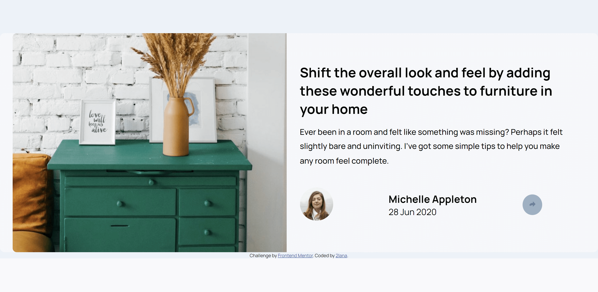
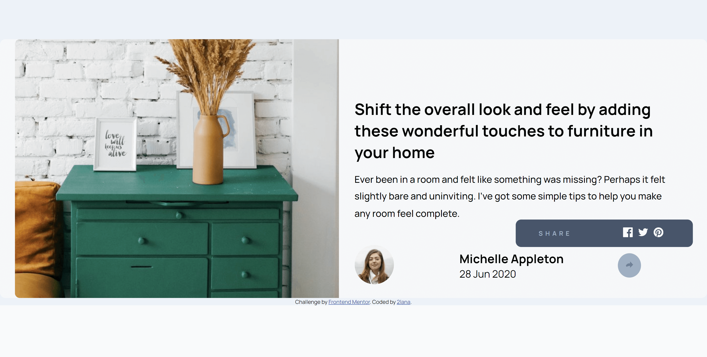
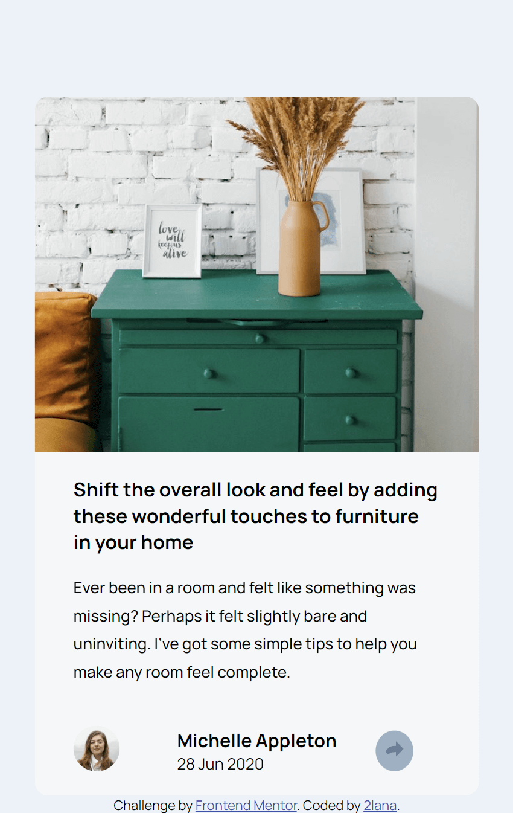
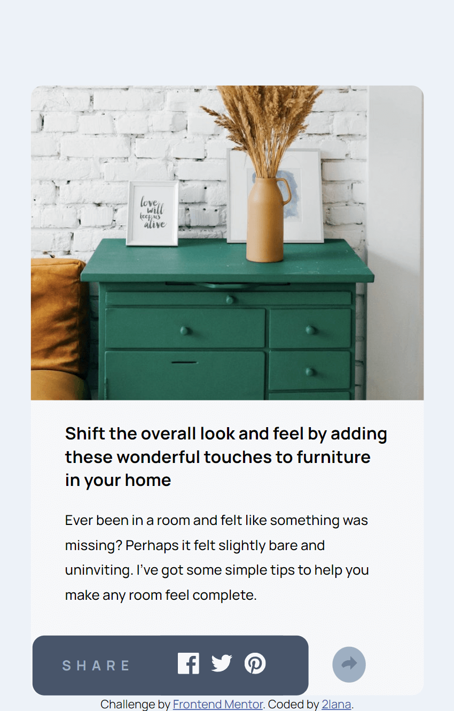

# Frontend Mentor - Article preview component solution

This is a solution to the [Article preview component challenge on Frontend Mentor](https://www.frontendmentor.io/challenges/article-preview-component-dYBN_pYFT). Frontend Mentor challenges help me improve my coding skills by building realistic projects.

## Table of contents

- [Overview](#overview)
  - [The challenge](#the-challenge)
  - [Screenshot](#screenshot)
  - [Links](#links)
- [My process](#my-process)
  - [Built with](#built-with)
  - [What I learned](#what-i-learned)
  - [Continued development](#continued-development)
  - [Useful resources](#useful-resources)
- [Author](#author)
- [Acknowledgments](#acknowledgments)

## Overview

### The challenge

Users should be able to:

- View the optimal layout for the component depending on their device's screen size
- See the social media share links when they click the share icon

### Screenshot






### Links

- Solution URL: [Add solution URL here](https://your-solution-url.com)
- Live Site URL: [Add live site URL here](https://your-live-site-url.com)

## My process

### Built with

- Semantic HTML5 markup
- CSS custom properties
- Flexbox
- CSS Grid
- Mobile-first workflow
- Java-Script
- [Styled Components](https://styled-components.com/) - For styles

### What I learned

My major learnings while working through this project.

See below:

```html
<div id="share-image">
  <div id="visible-image-share">
    
  </div>
</div>
```

```css
#visible-image-share {
  margin: 0.5rem;
}
```

```js
const shareImage = document.querySelector("#visible-image-share");
const shareBox = document.querySelector(".share-box");

shareImage.addEventListener("click", function () {
  shareBox.classList.toggle("share-hidden");
});
```

### Continued development

I want to continue focusing on in future projects. These could be concepts still not completely comfortable with or techniques found useful that want to refine and perfect.

### Useful resources

- [frontendmentor](https://www.frontendmentor.io/) - This resource gives me the opportunities to learn more about the use frontend and real practice code simple challenges for beginners. Respect!
- [jqueryvalidation](https://jqueryvalidation.org/validate/) - This jQuery plugin makes simple clientside form validation easy.
- [freecodecamp](https://www.freecodecamp.org/) - This recource helped me learn to code
- [developer.mozilla](https://developer.mozilla.org) - This helped me as resourses for developers by developers.
- [w3schools](https://www.w3schools.com/) - This is an amazing resource which helped me better understand html, css. I'd recommend it to anyone still learning technical concept.
- [screen resolution simulator](https://searchenginereports.net/screen-resolution-simulator) - This is an amazing resource which helped me.
- [Chrome DevTools](https://developer.chrome.com/docs/devtools/console/) - This recource help me testing html and css.
- [W3C](https://validator.w3.org/) - This recource help me checks the markup validity of Web documents in HTML and CSS.
- [docs.github](https://docs.github.com/en/get-started) - This recource helped me try to understand githab for the first time in my life. I created three repositories, two folders and deleted them several times, it’s a nightmare.

Most YouTube channels represent the author’s personal point of view. Only documentation should be examined.

## Author

- Website - [Add your name here](https://www.your-site.com)
- Frontend Mentor - [@yourusername](https://www.frontendmentor.io/profile/yourusername)

## Acknowledgments

Only practice

Grateful for reading and reply to every constructive comment.
